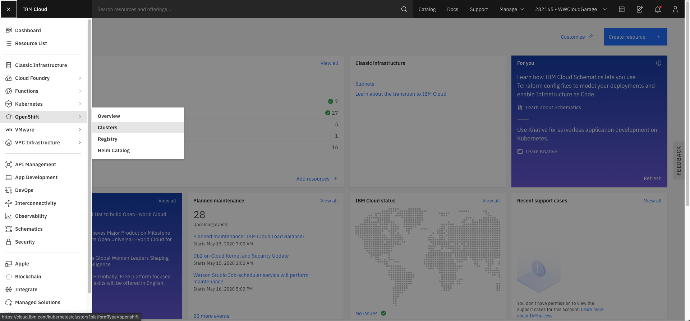
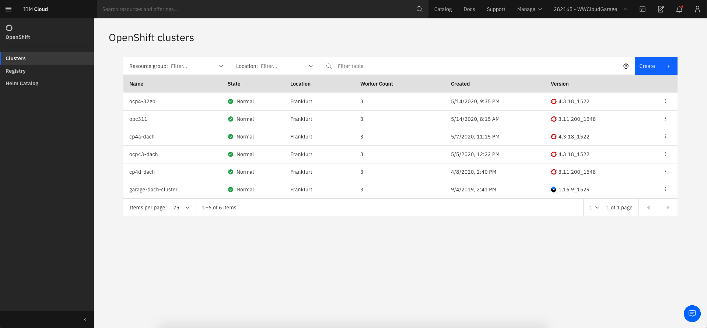
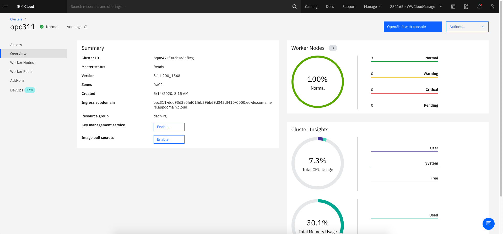
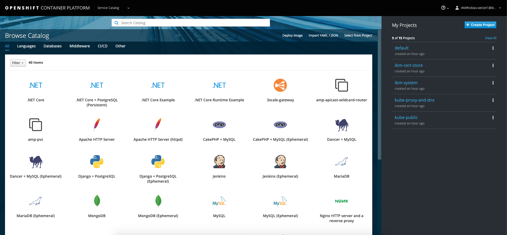
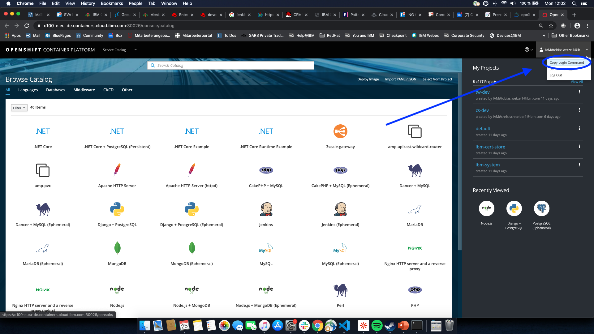

# Lab 0: Cloud and Cluster access check

Before we can start with any labs, the access to the IBM Cloud and the OpenShift cluster have to be validated.

## Log into the IBM Cloud and cluster UI

Log into IBM Cloud https://cloud.ibm.com/login and **select the account for your training (e.g. IBM Garage for Cloud...) in the upper right corner**.

Navigate to **Menu** &rarr; **OpenShift** &rarr; **Clusters** as shown below.



You should see a list of cluster, containing at least one OpenShift cluster with version 3.11.



Select a cluster.You should see the overview of the cluster, with a summary about the cluster, worker node status and some cluster insights.



Next, open the **OpenShift Web Console**, by clicking on the blue button on the top right.

You should be presented the OpenShift landing page:



## Log into the cluster with the CLI

Now let's log into the cluster with the cli to perform the first operations on the cluster.

Therefore, click on your name in the top right corner and then select **Copy Login Command**.



Open up a local terminal, paste the login command and execute it. You are presented a list of projects.

```bash
$ oc login https://... --token=XXX

Logged into "https://c100-e.eu-de.containers.cloud.ibm.com:30026" as "IAM#<your account>" using the token provided.

You have access to the following projects and can switch between them with 'oc project <projectname>':

  * default
    ibm-cert-store
    ibm-system
    kube-proxy-and-dns
    kube-public
    kube-service-catalog
    kube-system
    openshift
    openshift-ansible-service-broker
    openshift-console
    openshift-infra
    openshift-monitoring
    openshift-node
    openshift-template-service-broker
    openshift-web-console

Using project "default".
```

If all of this worked, you are ready to start with the labs.
