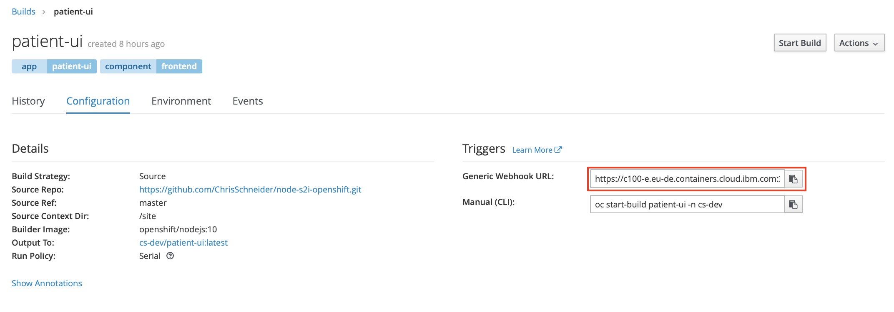
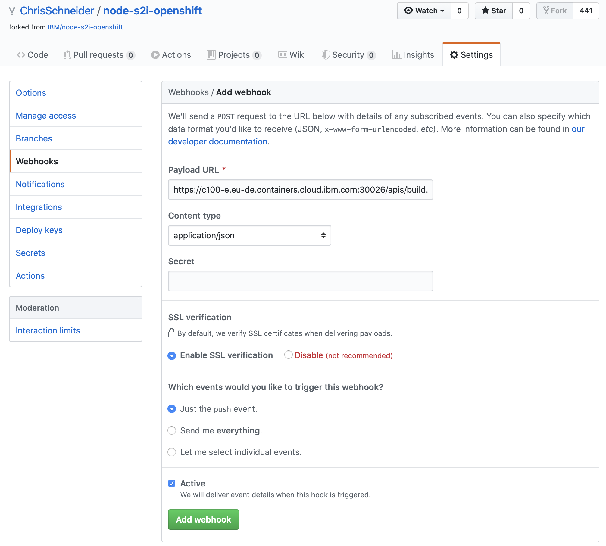
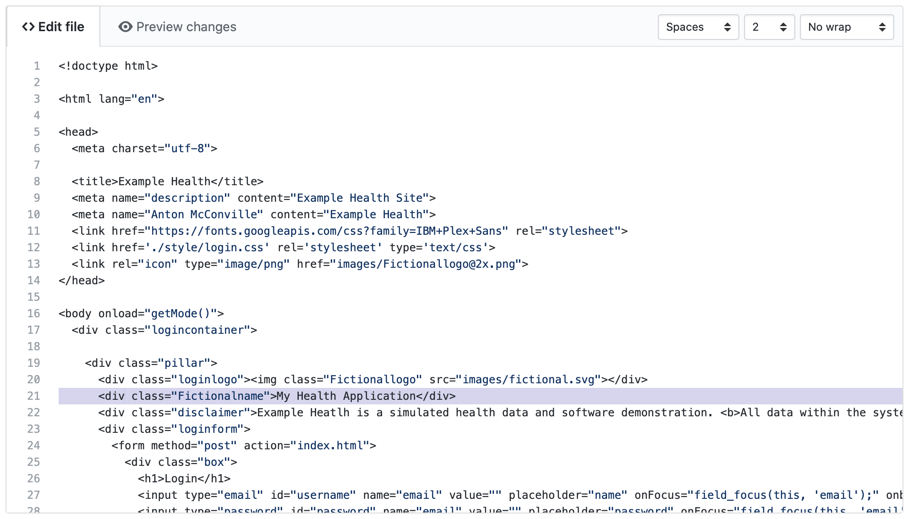
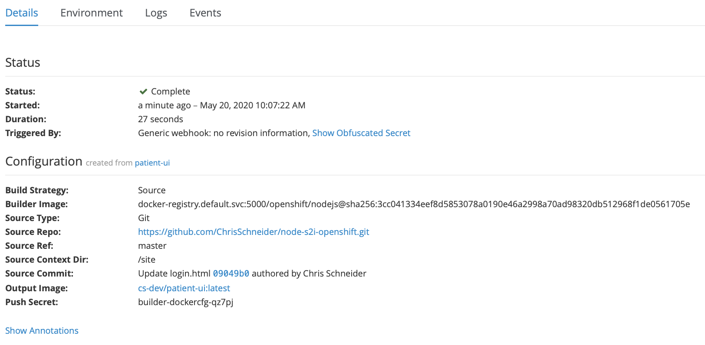
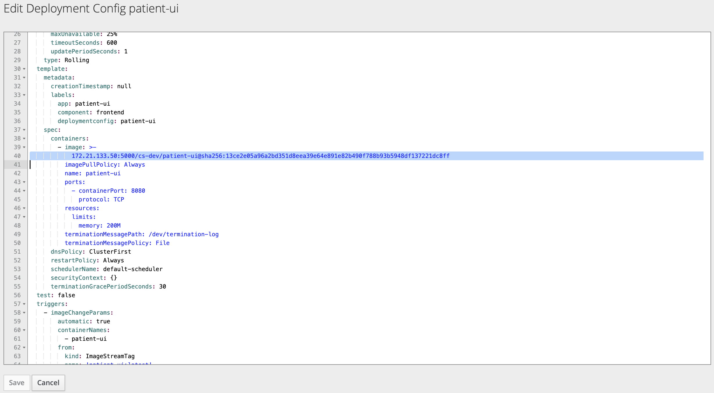
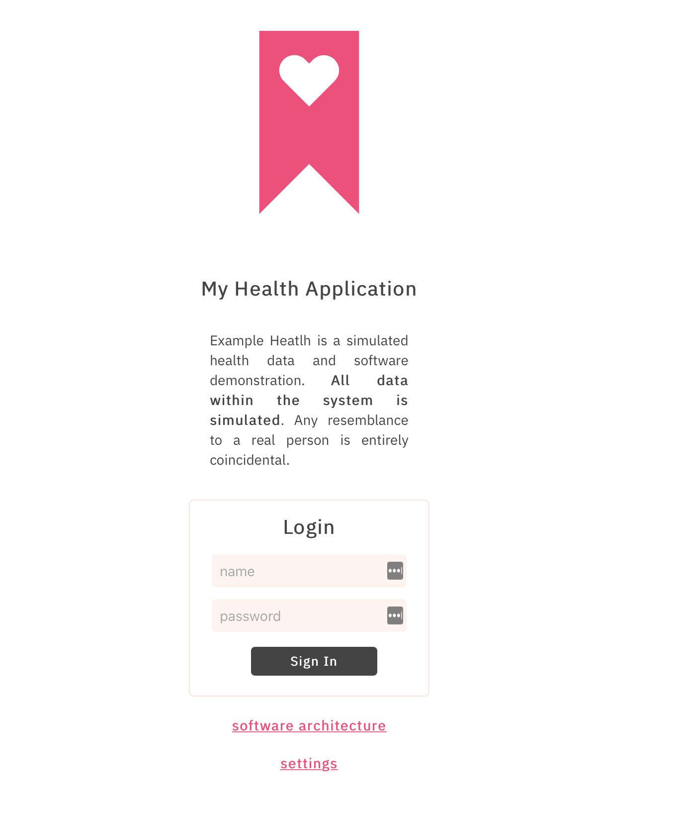

# Lab 4: App Updates

## Setup Automatic builds using webhooks

With the *Webhook* mechanism GitHub or another source code management system notifies the OpenShift cluster of a new event, for example when a commit is pushed.

### Get the webhook URL

Go to your OpenShift cluster's Web Console and select your project. Click on `Builds` > `Builds` > `patient-ui` and select the `Configuration` tab.

Note down the `Generic Webhook URL`.

### Add a new webhook in GitHub

Navigate to your repository on GitHub, click on the `Settings` tab and select `Webhooks` in the menu on the left side. Then click `Add webhook`. You might be prompted to enter your password again. The `Add Webhook` page should be shown:

Paste the `Generic Webhook URL` from the prior step into the `Payload URL` field. Select `application/json` as `Content-type`. Then click `Add webhook`.

GitHub will verify the webhook URL with a test request (ping) and show a green check mark on success. `Reload the page` after a few seconods:

*Note: Testing the Webhook will trigger a new build*

## Updating the application

The application update process:

1. User updates source code from v1 to v2
1. GitHub webhook sends notification to the OpenShift cluster, which automatically triggers a new build
1. A new container image is built using S2I and stored in the image stream
1. Image stream change triggers automatic deployment of v2 pods
1. After the new v2 pods are rolled out, OpenShift directs new requests to them and terminates the v1 pods

### Update source code in GitHub

In your GitHub repository browse to the file `site/public/login.html` and click on the `edit` (pen) icon:

Then change the `
` of your website, for example:

Commit the changes by clicking the `Commit changes` button.

### Review updates

Next you will inspect the new build and deployment in your OpenShift project.

#### New build was triggered

Browse to `Builds` > `Builds` and click on the latest build (e.g. `#3`):

Here you can see that the build was `Triggered By: Generic webhook` with the `Source Commit: Update login.html`

#### New image stored in the image stream

Next browse to `Builds` > `Images` to view the `patient-ui` Image Stream, which should have been updated a few minutes ago:

#### New deployment triggered with v2 pods

Updating an image in the image stream will trigger an update of your application's deployment.

Browse to `Applications` > `Deployments`, where you will see that for each build the `patient-ui` deployment was updated:

Click on `Actions` > `Edit YAML` to view the updated deployment configuration, referencing the new container image:

The `sha256:...` identifier is the same as the new identifier in the image stream.

*If you want to make sure the image changed, you can browse to a prior version of the deployment (e.g. #1) and view its YAML, where you will see a differnt image reference.*

#### Open the updated application

Then open your application in your browser to see the new login screen:

*You might need to force-reload the website (Strg-Shift-R or pressing Strg-R twice), as an old version might still be cached in your browser*
