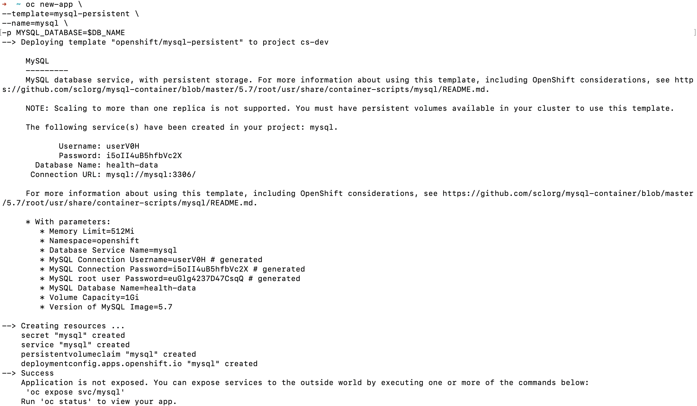
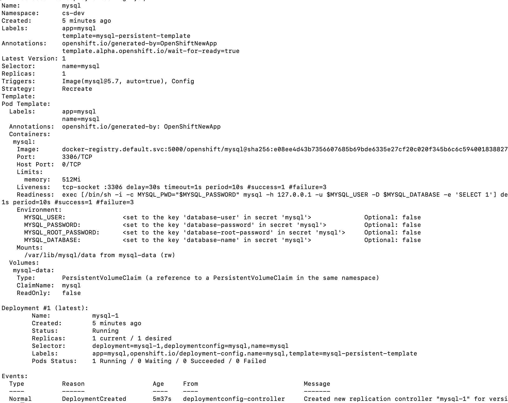
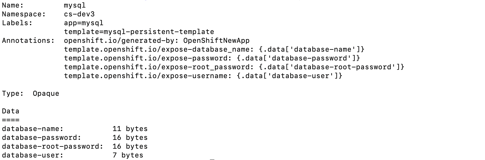
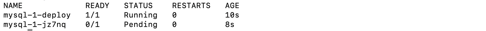
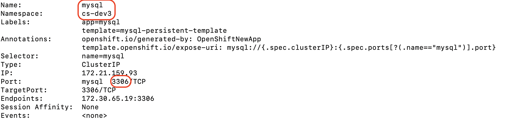
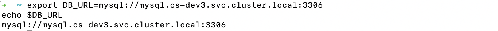
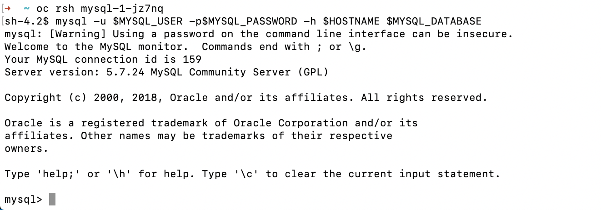
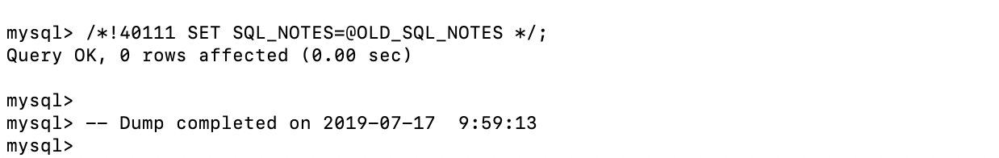

# Lab 5a: Persistance with a MySQL database

In this lab you will learn how to:
* Create and work with a MySQL database in OpenShift 3
* Make it available to other applications using services
* Store credentials in a Secret

## MySQL database

First you will create a MySQL database in your Open Shift project.

If you are not connencted to your OpenShift cluster, please re-run the commands from the `Log into the cluster with the CLI` section of Lab 1.

For convenience store the database name in a variable:

```bash
export DB_NAME=health_data
echo $DB_NAME
```

### Create the MySQL database

To store the data of our application between restarts we create a MySQL database with persistent storage using the `mysql-persistent` OpenShift template:

```bash
oc new-app \
--template=mysql-persistent \
--name=mysql \
-p MYSQL_DATABASE=$DB_NAME
```



Check that the database _deployment_ was created:

```bash
oc get deploymentconfigs
```


```bash
oc describe deploymentconfig mysql
```



Check that a _persistent volume claim_ was created to store the MySQL database:

```bash
oc get pvc
```


Check that a _secret_ where the database credentials are stored was created:

```bash
oc get secrets
```


```bash
oc describe secret mysql
```



Check that the database is ready:

```bash
oc get pods
```



**Wait until only one `mysql-...` pod is left with status `Running` and `1/1` containers are ready!**


> Tip: You can also check the status of the applications with:

```bash
oc status
```

### Construct the URL of the MySQL service

To communicate between pods within the cluster and to avoid hard-coding IP addresses in applications, each service gets its own hostname by OpenShift's internal DNS service.

The hostnames follow the format: `<service-name>.<namespace>.svc.cluster.local:<port>`

You can retrieve the parameters needed to construct a hostname for a service with:

```bash
oc describe service mysql
```



Construct the database URL with using these parameters and save it in the `DB_URL` variable:

```bash
export DB_URL=mysql://<Name>.<Namespace>.svc.cluster.local:<Port>
echo $DB_URL
```



### Store the JDBC-URL in a secret

Secrets provide a mechanism to store and retrieve sensitive information such as passwords in OpenShift.

Next you will create a secret that stores a JDBC connection URL your backend can use to connenct to the MySQL database:

```bash
oc create secret generic mysql-jdbc \
    --from-literal="jdbc-url=jdbc:$DB_URL/$DB_NAME?sessionVariables=sql_mode=''"
```

Check that the secret was created:

```bash
oc get secrets
```


### Import the database schema

Although the MySQL database is running in your cluster, it is still pretty empty. Next you will learn how to connect to the MySQL pod and run MySQL commands from within the container to populate the database with its first tables.

Therefore you first need to identify the name of the pod running your MySQL database. You can view a list of pods in your project with:

```bash
oc get pods
```

Then, open a remote shell session to the pod with the following command, replacing `$POD_NAME` with the name of your `mysql-...` pod:

```bash
oc rsh $POD_NAME
```

Within the pod's bash shell you can now run the `mysql` commad to start an interactive MySQL session:

```bash
mysql -u $MYSQL_USER -p$MYSQL_PASSWORD -h $HOSTNAME $MYSQL_DATABASE
```

_Note: These environment variables such as `MYSQL_USER` are passed to the `mysql`-pod by OpenShift. When you create your backend service in the next section you will see how you can specify environment variables for your pods._



Next copy, paste and execute the commands from `https://github.com/IBM/example-health-jee-openshift/tree/master/example-health-api/samples/health_schema.sql` within the bash session. The last lines of the output should look as following:



To verify that the schema has been created, run this command to show the list of exisiting tables:

```bash
show tables;
```

It should show the following list:

```bash
+-----------------------+
| Tables_in_health_data |
+-----------------------+
| Allergies             |
| Appointments          |
| MESSAGE               |
| Observations          |
| Organizations         |
| Patients              |
| Prescriptions         |
| Providers             |
| SEQUENCE              |
+-----------------------+
9 rows in set (0.00 sec)
```

Finally, close the session with `Ctrl + D` or type `exit` twice


## Conclusion

In this lab we explored how:

- A MySQL database is created with `oc create app`
- Data is stored in `Persistent Volumes`
- `Secrets` are used to store sensitive information
- Commands are ran within a container using `oc rsh`
