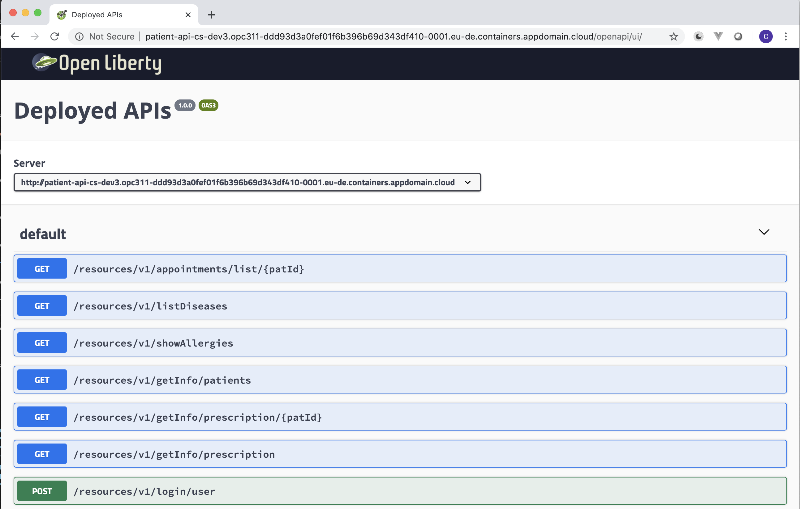
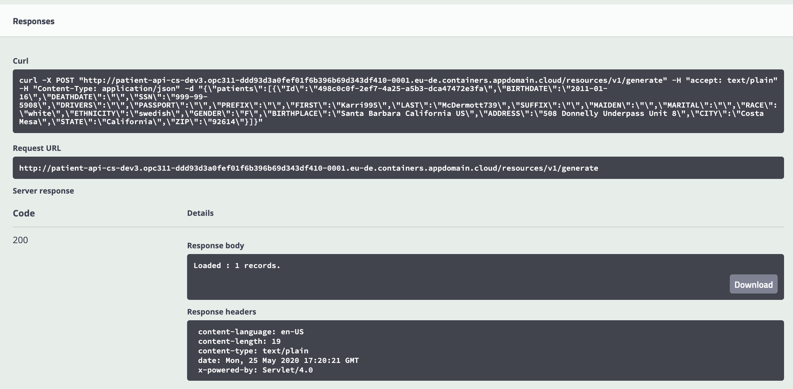
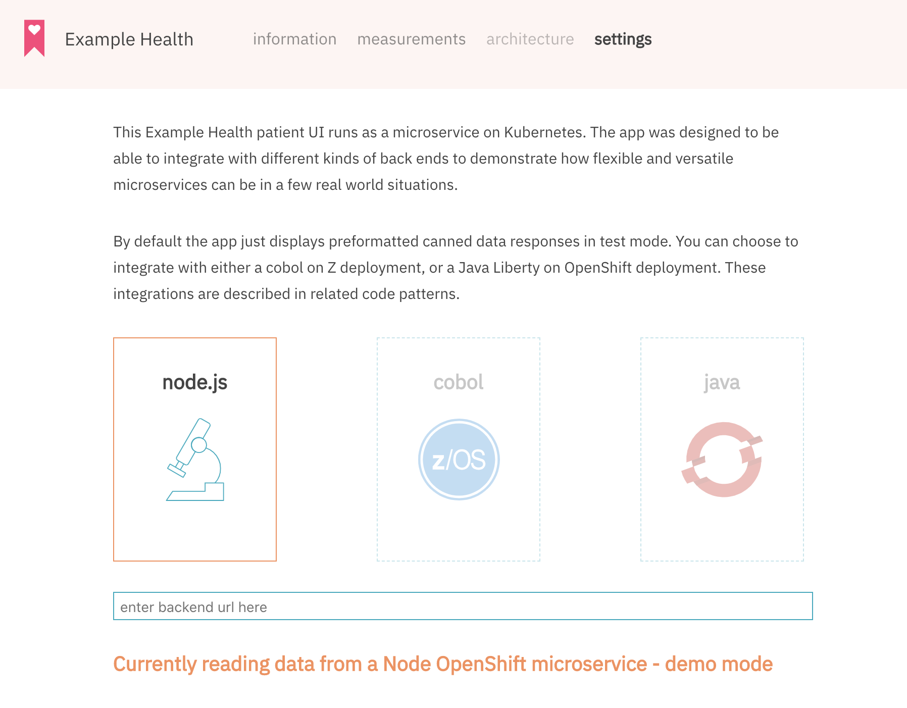
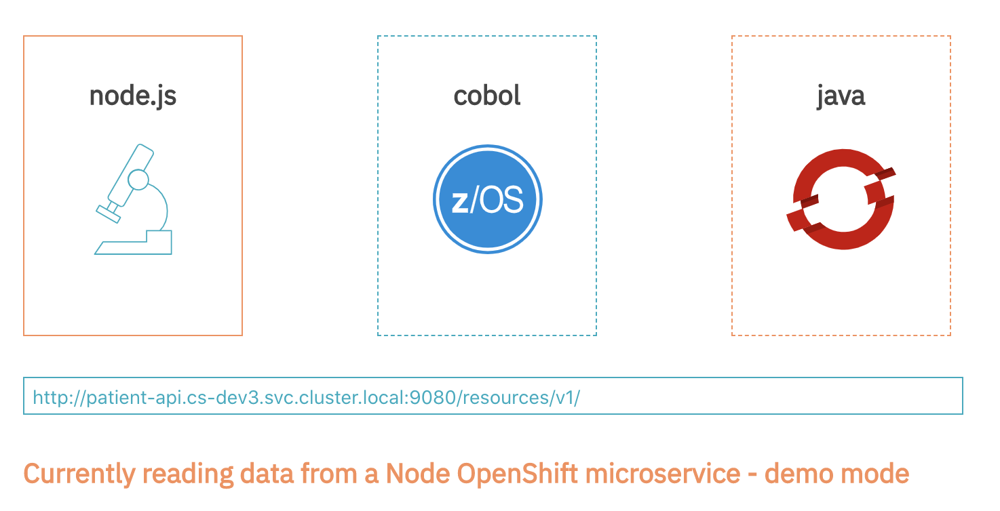
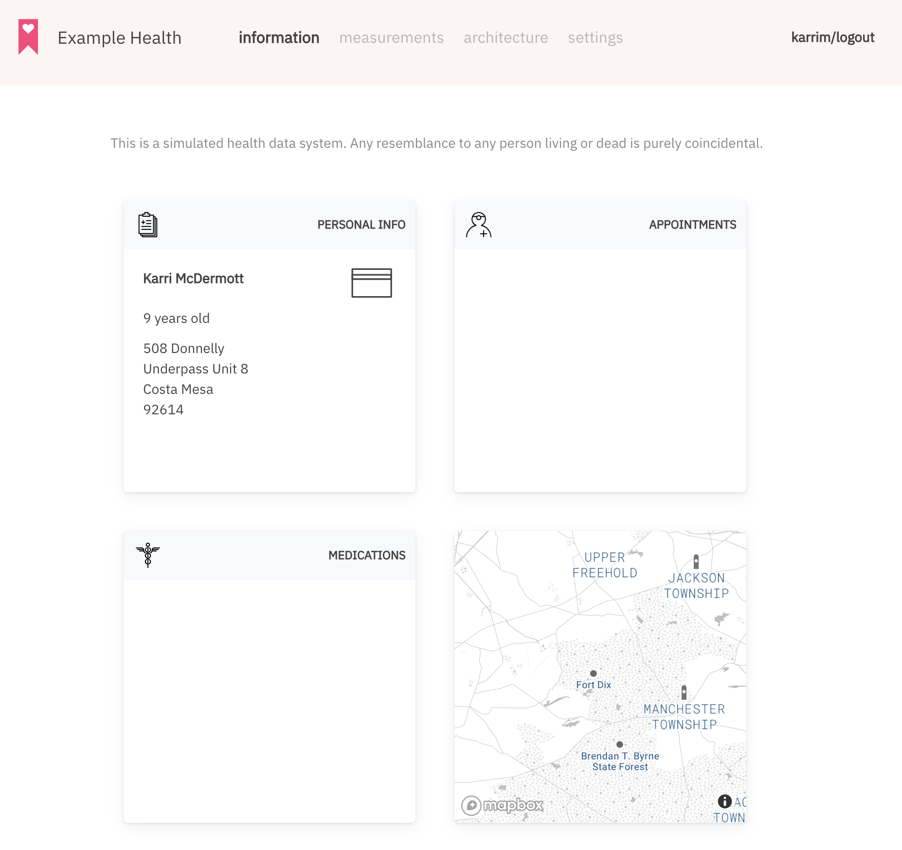

# Lab 5: Add a Java Backend Services with the CLI and Infrastructure-as-Code

After the MySQL database is now ready, you will deploy a backend service that connects to the database and frontend.

In this lab you will learn how to:

* Create a container image for a Java backend application with a custom Dockerfile
* Create OpenShift resources with YAML resource definitions (Infrastructure-as-Code)
* Make the back-end available with a Service and FQDN
* Pass credentials from a Secret to a container using environment variables


### Create a GitHub repository for the backend service

First, fork the Java backend GitHub repository:

`https://github.com/IBM/example-health-jee-openshift`

### Update the Dockerfile

To build a container image on OpenShift we need to replace the Dockerfile in `example-health-api/Dockerfile` with the following Dockerfile (you can use GitHub's web editor to change the file, see Lab 4):

```Dockerfile
# 1. Package the application using a maven-based builder image

FROM maven:3.6-jdk-8 as builder

COPY . .
RUN mvn package


# 2. Build the Open Liberty image

FROM openliberty/open-liberty:javaee8-ubi-min

ENV INSTALL_DIR /opt/ol/wlp/
ENV SERVER_DIR /opt/ol/wlp/usr/servers/defaultServer/

# Add MySQL-Connector
RUN curl -o ${INSTALL_DIR}lib/mysql-connector-java-8.0.16.jar https://repo1.maven.org/maven2/mysql/mysql-connector-java/8.0.16/mysql-connector-java-8.0.16.jar
COPY liberty-mysql/mysql-driver.xml ${SERVER_DIR}configDropins/defaults/

# Copy WAR-file from builder image
COPY --from=builder target/health-api.war ${SERVER_DIR}apps

# Copy configs
COPY liberty/server.xml $SERVER_DIR
COPY liberty/jvm.options $SERVER_DIR

# Expose port 9080 where the application runs on
EXPOSE 9080
```

This Dockerfile first packages the JEE application using a `maven` container image. Then it builds the actual container that runs the application based on an Open Liberty base image.

**Make sure to commit these changes to your Git repository!**

## Deploy the backend with YAML resource definitions

Instead of letting OpenShift create the resources for you with the Web Console, you will create them with YAML resource definitions and the OpenShift CLI yourself.

Defining the infrastructure as code is helpful for re-using applications and promoting them accross different environments.

### Build step

On your computer create a new file with the YAML below named `build-resources.yaml`

Replace `<YOUR GITHUB URL>` with the URL of your GitHub repository

```yaml
apiVersion: v1
kind: BuildConfig
metadata:
  name: patient-api
  labels:
    app: patient-api
    component: backend
spec:
  output:
    to:
      kind: ImageStreamTag
      name: patient-api:latest
  source:
    type: Git
    git:
      ref: master
      uri: <YOUR GITHUB URL>
    contextDir: /example-health-api
  strategy:
    type: Docker
  triggers:
    - type: ConfigChange
---
apiVersion: v1
kind: ImageStream
metadata:
  name: patient-api
  labels:
    app: patient-api
    component: backend
spec:
  tags:
    - name: latest
```

To create these resources in OpenShift run:

```bash
oc apply -f build-resources.yaml
```


This creates a _build config_ and _image stream_ in your OpenShift project and starts your first build.

You can start another build with:

```bash
oc start-build patient-api
```


Check the logs of the first build by first retrieving the name of the pod and then retrieving the logs of the pod:

```bash
oc get pods

oc logs patient-api-1-build
```

You can check the status of a build with:

```bash
oc get builds
```

The output should show that the `patient-api-...` build is `Complete`:


### Deployment step

After building the container image we need to deploy the image.

Therefore create a new file with the YAML below named `deployment-resources.yaml`:

```yaml
apiVersion: v1
kind: DeploymentConfig
metadata:
  name: patient-api
  labels:
    app: patient-api
    component: backend
spec:
  replicas: 1
  selector:
    deploymentconfig: patient-api
  template:
    metadata:
      labels:
        app: patient-api
        component: backend
        deploymentconfig: patient-api
    spec:
      containers:
        - name: patient-api
          image: patient-api:latest
          imagePullPolicy: Always
          livenessProbe:
            failureThreshold: 3
            httpGet:
              path: /health
              port: 9080
              scheme: HTTP
            periodSeconds: 10
            successThreshold: 1
            timeoutSeconds: 1
            initialDelaySeconds: 15
          ports:
            - containerPort: 9080
          env:
            - name: ENV_MYSQL_URL
              valueFrom:
                secretKeyRef:
                  name: mysql-jdbc
                  key: jdbc-url
            - name: ENV_MYSQL_USER
              valueFrom:
                secretKeyRef:
                  name: mysql
                  key: database-user
            - name: ENV_MYSQL_PWD
              valueFrom:
                secretKeyRef:
                  name: mysql
                  key: database-password
      restartPolicy: Always
  triggers:
    - type: ConfigChange
    - type: ImageChange
      imageChangeParams:
        automatic: true
        containerNames:
          - patient-api
        from:
          kind: ImageStreamTag
          name: patient-api:latest
---
apiVersion: v1
kind: Service
metadata:
  name: patient-api
  labels:
    app: patient-api
    component: backend
spec:
  ports:
    - name: 9080-tcp
      port: 9080
      protocol: TCP
      targetPort: 9080
  selector:
    deploymentconfig: patient-api
---
apiVersion: v1
kind: Route
metadata:
  name: patient-api
  labels:
    app: patient-api
    component: backend
spec:
  port:
    targetPort: 9080-tcp
  to:
    kind: Service
    name: patient-api
    weight: 100
```

Then again apply these resource definitions to OpenShift with:

```bash
oc apply -f deployment-resources.yaml
```

This creates a _deployment config_, _service_ and _route_ in your OpenShift project.


Verify that the deployment was successful:

```bash
oc get deploymentconfigs
```

```bash
oc get pods
```

Make sure that one pod is running.

> Note: In the yaml file we have defined a liveness probe, which checks if the pod is answering on the /health route. If it doesn't the pod status is considered as failed and the pod is then restarted.

<hr />

## Add a patient with the OpenAPI Browser

The backend application comes with a browser UI for its OpenAPI specification.

To open the UI, oObtain the hostname assigned to the route:

```bash
oc get route patient-api
```

Navigate in your browser to `<hostname>/openapi/ui/`. An OpenAPI specification of the endpoints and operations supported by the Java EE application is shown:



Populate database with some data by clicking on `/resources/v1/generate` (last item in the list) and then `Try it out`.

Paste the following JSON into the textfield:

```json
{
  "patients": [
    {
      "Id": "498c0c0f-2ef7-4a25-a5b3-dca47472e3fa",
      "BIRTHDATE": "2011-01-16",
      "DEATHDATE": "",
      "SSN": "999-99-5908",
      "DRIVERS": "",
      "PASSPORT": "",
      "PREFIX": "",
      "FIRST": "Karri995",
      "LAST": "McDermott739",
      "SUFFIX": "",
      "MAIDEN": "",
      "MARITAL": "",
      "RACE": "white",
      "ETHNICITY": "swedish",
      "GENDER": "F",
      "BIRTHPLACE": "Santa Barbara  California  US",
      "ADDRESS": "508 Donnelly Underpass Unit 8",
      "CITY": "Costa Mesa",
      "STATE": "California",
      "ZIP": "92614"
    }
  ]
}
```

Then click `Execute` to send the request.



<hr />

## Open the front-end and point it to the API service

To open the front-end retrieve its URL with `oc get route`:

```bash
oc get route patient-ui
```

Open the URL in your web browser and click on `settings`:



Here you can change the backend URL to point to your just deployed `patient-api` service.

Since both services run within the OpenShift cluster they can communicate with each other using OpenShift's internal DNS service.

Run `oc describe service` to retrieve the information neccessary to construct the backend URL:

```bash
oc describe service patient-api
```

Fill `<Name>`, `<Namespace>` and `<Port>` in the URL and paste it into the `enter backend url here` field:

    http://<Name>.<Namespace>.svc.cluster.local:<Port>/resources/v1/

Please make sure you add the trailing `/` to your URL!



Then click on a whitespace next to the URL field, wait a few seconds to make sure the URL is updated and then click on `java` to change the backend type.

<hr />

## Login to see the personal info

On the Login screen you can now login with username `karrim` and password `karrim`. These were automatically generated by the backend based on the first and last name of the user we added.

After logging in you will be able to see the user's personal information, which is retrieved by the `patient-ui` service from the `patient-api` and `mysql` services:



<hr />

## Optional: Explore the application with the OpenShift CLI and Web Console

Please take some time to further explore your microservices app using the OpenShift Container Platform CLI and Web Conosole.

You can retrieve a list of all CLI commands with:

```bash
oc --help
```

You can view YAML resource definitions with:

```bash
oc get deploymentconfig <my-deploymentconfig> -o yaml
oc get pod <my-pod> -o yaml
```

What properties did OpenShift populate that were not defined in the YAML resource definitions?

## Conclusion

In this lab we explored how:

- Information is passed with `environment variables` into containers
- Two pods communicate with each other using a `Service` and OpenShift's `internal DNS`
- How Infrastructure-as-Code works with `YAML resource definitions` and `oc apply`
